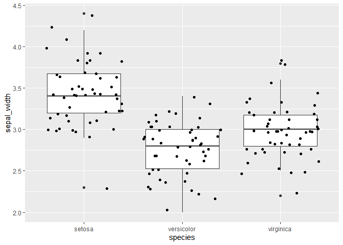
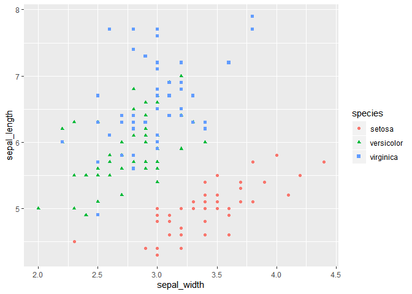
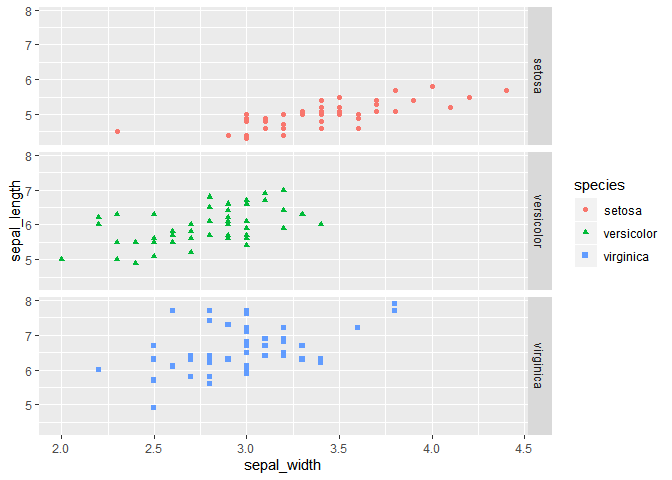

<!---The following chunk allows errors when knitting--->


**When you make an Rmd file for participation or homework, be sure to do this**:

1. Change the file output to both html and md _documents_ (not notebook).
  - See the `keep_md: TRUE` argument above.

2. `knit` the document. 

3. Stage and commit the Rmd and knitted documents.


# Let's review some `dplyr` syntax

Load the `tidyverse` package.
    

    

## `select()`, `rename()`, `filter()`, `mutate()`, and a little plotting

Let's use the `mtcars` dataset. Complete the following tasks. Chain together
all of the commands in a task using the pipe `%>%`.

1. Show the miles per gallon and horsepower for cars with 6 cylinders. Also
   convert the data frame to a tibble (keep the rownames and store them in the
   tibble with a descriptive variable name). Store this result as a new object
   with a descriptive object name.


```
## # A tibble: 7 x 4
##   car_model        mpg    hp   cyl
##   <chr>          <dbl> <dbl> <dbl>
## 1 Mazda RX4       21     110     6
## 2 Mazda RX4 Wag   21     110     6
## 3 Hornet 4 Drive  21.4   110     6
## 4 Valiant         18.1   105     6
## 5 Merc 280        19.2   123     6
## 6 Merc 280C       17.8   123     6
## 7 Ferrari Dino    19.7   175     6
```

2. Print the results from Task 1 in an appealing way by using `knitr::kable()`.


car_model          mpg    hp   cyl
---------------  -----  ----  ----
Mazda RX4         21.0   110     6
Mazda RX4 Wag     21.0   110     6
Hornet 4 Drive    21.4   110     6
Valiant           18.1   105     6
Merc 280          19.2   123     6
Merc 280C         17.8   123     6
Ferrari Dino      19.7   175     6

Let's use the `iris` dataset. Complete the following tasks. Chain together
all of the commands in a task using the pipe `%>%`.

3. Rename the variables to be all lowercase and to separate words with "_"
   instead of ".". Put the species name variable first. Store this result as 
   a new object.


```
##     sepal_length sepal_width petal_length petal_width    species
## 1            5.1         3.5          1.4         0.2     setosa
## 2            4.9         3.0          1.4         0.2     setosa
## 3            4.7         3.2          1.3         0.2     setosa
## 4            4.6         3.1          1.5         0.2     setosa
## 5            5.0         3.6          1.4         0.2     setosa
## 6            5.4         3.9          1.7         0.4     setosa
## 7            4.6         3.4          1.4         0.3     setosa
## 8            5.0         3.4          1.5         0.2     setosa
## 9            4.4         2.9          1.4         0.2     setosa
## 10           4.9         3.1          1.5         0.1     setosa
## 11           5.4         3.7          1.5         0.2     setosa
## 12           4.8         3.4          1.6         0.2     setosa
## 13           4.8         3.0          1.4         0.1     setosa
## 14           4.3         3.0          1.1         0.1     setosa
## 15           5.8         4.0          1.2         0.2     setosa
## 16           5.7         4.4          1.5         0.4     setosa
## 17           5.4         3.9          1.3         0.4     setosa
## 18           5.1         3.5          1.4         0.3     setosa
## 19           5.7         3.8          1.7         0.3     setosa
## 20           5.1         3.8          1.5         0.3     setosa
## 21           5.4         3.4          1.7         0.2     setosa
## 22           5.1         3.7          1.5         0.4     setosa
## 23           4.6         3.6          1.0         0.2     setosa
## 24           5.1         3.3          1.7         0.5     setosa
## 25           4.8         3.4          1.9         0.2     setosa
## 26           5.0         3.0          1.6         0.2     setosa
## 27           5.0         3.4          1.6         0.4     setosa
## 28           5.2         3.5          1.5         0.2     setosa
## 29           5.2         3.4          1.4         0.2     setosa
## 30           4.7         3.2          1.6         0.2     setosa
## 31           4.8         3.1          1.6         0.2     setosa
## 32           5.4         3.4          1.5         0.4     setosa
## 33           5.2         4.1          1.5         0.1     setosa
## 34           5.5         4.2          1.4         0.2     setosa
## 35           4.9         3.1          1.5         0.2     setosa
## 36           5.0         3.2          1.2         0.2     setosa
## 37           5.5         3.5          1.3         0.2     setosa
## 38           4.9         3.6          1.4         0.1     setosa
## 39           4.4         3.0          1.3         0.2     setosa
## 40           5.1         3.4          1.5         0.2     setosa
## 41           5.0         3.5          1.3         0.3     setosa
## 42           4.5         2.3          1.3         0.3     setosa
## 43           4.4         3.2          1.3         0.2     setosa
## 44           5.0         3.5          1.6         0.6     setosa
## 45           5.1         3.8          1.9         0.4     setosa
## 46           4.8         3.0          1.4         0.3     setosa
## 47           5.1         3.8          1.6         0.2     setosa
## 48           4.6         3.2          1.4         0.2     setosa
## 49           5.3         3.7          1.5         0.2     setosa
## 50           5.0         3.3          1.4         0.2     setosa
## 51           7.0         3.2          4.7         1.4 versicolor
## 52           6.4         3.2          4.5         1.5 versicolor
## 53           6.9         3.1          4.9         1.5 versicolor
## 54           5.5         2.3          4.0         1.3 versicolor
## 55           6.5         2.8          4.6         1.5 versicolor
## 56           5.7         2.8          4.5         1.3 versicolor
## 57           6.3         3.3          4.7         1.6 versicolor
## 58           4.9         2.4          3.3         1.0 versicolor
## 59           6.6         2.9          4.6         1.3 versicolor
## 60           5.2         2.7          3.9         1.4 versicolor
## 61           5.0         2.0          3.5         1.0 versicolor
## 62           5.9         3.0          4.2         1.5 versicolor
## 63           6.0         2.2          4.0         1.0 versicolor
## 64           6.1         2.9          4.7         1.4 versicolor
## 65           5.6         2.9          3.6         1.3 versicolor
## 66           6.7         3.1          4.4         1.4 versicolor
## 67           5.6         3.0          4.5         1.5 versicolor
## 68           5.8         2.7          4.1         1.0 versicolor
## 69           6.2         2.2          4.5         1.5 versicolor
## 70           5.6         2.5          3.9         1.1 versicolor
## 71           5.9         3.2          4.8         1.8 versicolor
## 72           6.1         2.8          4.0         1.3 versicolor
## 73           6.3         2.5          4.9         1.5 versicolor
## 74           6.1         2.8          4.7         1.2 versicolor
## 75           6.4         2.9          4.3         1.3 versicolor
## 76           6.6         3.0          4.4         1.4 versicolor
## 77           6.8         2.8          4.8         1.4 versicolor
## 78           6.7         3.0          5.0         1.7 versicolor
## 79           6.0         2.9          4.5         1.5 versicolor
## 80           5.7         2.6          3.5         1.0 versicolor
## 81           5.5         2.4          3.8         1.1 versicolor
## 82           5.5         2.4          3.7         1.0 versicolor
## 83           5.8         2.7          3.9         1.2 versicolor
## 84           6.0         2.7          5.1         1.6 versicolor
## 85           5.4         3.0          4.5         1.5 versicolor
## 86           6.0         3.4          4.5         1.6 versicolor
## 87           6.7         3.1          4.7         1.5 versicolor
## 88           6.3         2.3          4.4         1.3 versicolor
## 89           5.6         3.0          4.1         1.3 versicolor
## 90           5.5         2.5          4.0         1.3 versicolor
## 91           5.5         2.6          4.4         1.2 versicolor
## 92           6.1         3.0          4.6         1.4 versicolor
## 93           5.8         2.6          4.0         1.2 versicolor
## 94           5.0         2.3          3.3         1.0 versicolor
## 95           5.6         2.7          4.2         1.3 versicolor
## 96           5.7         3.0          4.2         1.2 versicolor
## 97           5.7         2.9          4.2         1.3 versicolor
## 98           6.2         2.9          4.3         1.3 versicolor
## 99           5.1         2.5          3.0         1.1 versicolor
## 100          5.7         2.8          4.1         1.3 versicolor
## 101          6.3         3.3          6.0         2.5  virginica
## 102          5.8         2.7          5.1         1.9  virginica
## 103          7.1         3.0          5.9         2.1  virginica
## 104          6.3         2.9          5.6         1.8  virginica
## 105          6.5         3.0          5.8         2.2  virginica
## 106          7.6         3.0          6.6         2.1  virginica
## 107          4.9         2.5          4.5         1.7  virginica
## 108          7.3         2.9          6.3         1.8  virginica
## 109          6.7         2.5          5.8         1.8  virginica
## 110          7.2         3.6          6.1         2.5  virginica
## 111          6.5         3.2          5.1         2.0  virginica
## 112          6.4         2.7          5.3         1.9  virginica
## 113          6.8         3.0          5.5         2.1  virginica
## 114          5.7         2.5          5.0         2.0  virginica
## 115          5.8         2.8          5.1         2.4  virginica
## 116          6.4         3.2          5.3         2.3  virginica
## 117          6.5         3.0          5.5         1.8  virginica
## 118          7.7         3.8          6.7         2.2  virginica
## 119          7.7         2.6          6.9         2.3  virginica
## 120          6.0         2.2          5.0         1.5  virginica
## 121          6.9         3.2          5.7         2.3  virginica
## 122          5.6         2.8          4.9         2.0  virginica
## 123          7.7         2.8          6.7         2.0  virginica
## 124          6.3         2.7          4.9         1.8  virginica
## 125          6.7         3.3          5.7         2.1  virginica
## 126          7.2         3.2          6.0         1.8  virginica
## 127          6.2         2.8          4.8         1.8  virginica
## 128          6.1         3.0          4.9         1.8  virginica
## 129          6.4         2.8          5.6         2.1  virginica
## 130          7.2         3.0          5.8         1.6  virginica
## 131          7.4         2.8          6.1         1.9  virginica
## 132          7.9         3.8          6.4         2.0  virginica
## 133          6.4         2.8          5.6         2.2  virginica
## 134          6.3         2.8          5.1         1.5  virginica
## 135          6.1         2.6          5.6         1.4  virginica
## 136          7.7         3.0          6.1         2.3  virginica
## 137          6.3         3.4          5.6         2.4  virginica
## 138          6.4         3.1          5.5         1.8  virginica
## 139          6.0         3.0          4.8         1.8  virginica
## 140          6.9         3.1          5.4         2.1  virginica
## 141          6.7         3.1          5.6         2.4  virginica
## 142          6.9         3.1          5.1         2.3  virginica
## 143          5.8         2.7          5.1         1.9  virginica
## 144          6.8         3.2          5.9         2.3  virginica
## 145          6.7         3.3          5.7         2.5  virginica
## 146          6.7         3.0          5.2         2.3  virginica
## 147          6.3         2.5          5.0         1.9  virginica
## 148          6.5         3.0          5.2         2.0  virginica
## 149          6.2         3.4          5.4         2.3  virginica
## 150          5.9         3.0          5.1         1.8  virginica
```

4. Using the data from Task 3, plot the sepal width for each species. Perhaps 
   use a boxplot or a jitter plot (or both overlaid!). Be sure to format the
   axis labels nicely.

<!-- -->

5. `iris` expresses all of the measurements in centimeters. Convert them to 
   inches (1 in = 2.54 cm). Store this dataset as a new object.


```
##     sepal_length sepal_width petal_length petal_width    species
## 1       2.007874   1.3779528    0.5511811  0.07874016     setosa
## 2       1.929134   1.1811024    0.5511811  0.07874016     setosa
## 3       1.850394   1.2598425    0.5118110  0.07874016     setosa
## 4       1.811024   1.2204724    0.5905512  0.07874016     setosa
## 5       1.968504   1.4173228    0.5511811  0.07874016     setosa
## 6       2.125984   1.5354331    0.6692913  0.15748031     setosa
## 7       1.811024   1.3385827    0.5511811  0.11811024     setosa
## 8       1.968504   1.3385827    0.5905512  0.07874016     setosa
## 9       1.732283   1.1417323    0.5511811  0.07874016     setosa
## 10      1.929134   1.2204724    0.5905512  0.03937008     setosa
## 11      2.125984   1.4566929    0.5905512  0.07874016     setosa
## 12      1.889764   1.3385827    0.6299213  0.07874016     setosa
## 13      1.889764   1.1811024    0.5511811  0.03937008     setosa
## 14      1.692913   1.1811024    0.4330709  0.03937008     setosa
## 15      2.283465   1.5748031    0.4724409  0.07874016     setosa
## 16      2.244094   1.7322835    0.5905512  0.15748031     setosa
## 17      2.125984   1.5354331    0.5118110  0.15748031     setosa
## 18      2.007874   1.3779528    0.5511811  0.11811024     setosa
## 19      2.244094   1.4960630    0.6692913  0.11811024     setosa
## 20      2.007874   1.4960630    0.5905512  0.11811024     setosa
## 21      2.125984   1.3385827    0.6692913  0.07874016     setosa
## 22      2.007874   1.4566929    0.5905512  0.15748031     setosa
## 23      1.811024   1.4173228    0.3937008  0.07874016     setosa
## 24      2.007874   1.2992126    0.6692913  0.19685039     setosa
## 25      1.889764   1.3385827    0.7480315  0.07874016     setosa
## 26      1.968504   1.1811024    0.6299213  0.07874016     setosa
## 27      1.968504   1.3385827    0.6299213  0.15748031     setosa
## 28      2.047244   1.3779528    0.5905512  0.07874016     setosa
## 29      2.047244   1.3385827    0.5511811  0.07874016     setosa
## 30      1.850394   1.2598425    0.6299213  0.07874016     setosa
## 31      1.889764   1.2204724    0.6299213  0.07874016     setosa
## 32      2.125984   1.3385827    0.5905512  0.15748031     setosa
## 33      2.047244   1.6141732    0.5905512  0.03937008     setosa
## 34      2.165354   1.6535433    0.5511811  0.07874016     setosa
## 35      1.929134   1.2204724    0.5905512  0.07874016     setosa
## 36      1.968504   1.2598425    0.4724409  0.07874016     setosa
## 37      2.165354   1.3779528    0.5118110  0.07874016     setosa
## 38      1.929134   1.4173228    0.5511811  0.03937008     setosa
## 39      1.732283   1.1811024    0.5118110  0.07874016     setosa
## 40      2.007874   1.3385827    0.5905512  0.07874016     setosa
## 41      1.968504   1.3779528    0.5118110  0.11811024     setosa
## 42      1.771654   0.9055118    0.5118110  0.11811024     setosa
## 43      1.732283   1.2598425    0.5118110  0.07874016     setosa
## 44      1.968504   1.3779528    0.6299213  0.23622047     setosa
## 45      2.007874   1.4960630    0.7480315  0.15748031     setosa
## 46      1.889764   1.1811024    0.5511811  0.11811024     setosa
## 47      2.007874   1.4960630    0.6299213  0.07874016     setosa
## 48      1.811024   1.2598425    0.5511811  0.07874016     setosa
## 49      2.086614   1.4566929    0.5905512  0.07874016     setosa
## 50      1.968504   1.2992126    0.5511811  0.07874016     setosa
## 51      2.755906   1.2598425    1.8503937  0.55118110 versicolor
## 52      2.519685   1.2598425    1.7716535  0.59055118 versicolor
## 53      2.716535   1.2204724    1.9291339  0.59055118 versicolor
## 54      2.165354   0.9055118    1.5748031  0.51181102 versicolor
## 55      2.559055   1.1023622    1.8110236  0.59055118 versicolor
## 56      2.244094   1.1023622    1.7716535  0.51181102 versicolor
## 57      2.480315   1.2992126    1.8503937  0.62992126 versicolor
## 58      1.929134   0.9448819    1.2992126  0.39370079 versicolor
## 59      2.598425   1.1417323    1.8110236  0.51181102 versicolor
## 60      2.047244   1.0629921    1.5354331  0.55118110 versicolor
## 61      1.968504   0.7874016    1.3779528  0.39370079 versicolor
## 62      2.322835   1.1811024    1.6535433  0.59055118 versicolor
## 63      2.362205   0.8661417    1.5748031  0.39370079 versicolor
## 64      2.401575   1.1417323    1.8503937  0.55118110 versicolor
## 65      2.204724   1.1417323    1.4173228  0.51181102 versicolor
## 66      2.637795   1.2204724    1.7322835  0.55118110 versicolor
## 67      2.204724   1.1811024    1.7716535  0.59055118 versicolor
## 68      2.283465   1.0629921    1.6141732  0.39370079 versicolor
## 69      2.440945   0.8661417    1.7716535  0.59055118 versicolor
## 70      2.204724   0.9842520    1.5354331  0.43307087 versicolor
## 71      2.322835   1.2598425    1.8897638  0.70866142 versicolor
## 72      2.401575   1.1023622    1.5748031  0.51181102 versicolor
## 73      2.480315   0.9842520    1.9291339  0.59055118 versicolor
## 74      2.401575   1.1023622    1.8503937  0.47244094 versicolor
## 75      2.519685   1.1417323    1.6929134  0.51181102 versicolor
## 76      2.598425   1.1811024    1.7322835  0.55118110 versicolor
## 77      2.677165   1.1023622    1.8897638  0.55118110 versicolor
## 78      2.637795   1.1811024    1.9685039  0.66929134 versicolor
## 79      2.362205   1.1417323    1.7716535  0.59055118 versicolor
## 80      2.244094   1.0236220    1.3779528  0.39370079 versicolor
## 81      2.165354   0.9448819    1.4960630  0.43307087 versicolor
## 82      2.165354   0.9448819    1.4566929  0.39370079 versicolor
## 83      2.283465   1.0629921    1.5354331  0.47244094 versicolor
## 84      2.362205   1.0629921    2.0078740  0.62992126 versicolor
## 85      2.125984   1.1811024    1.7716535  0.59055118 versicolor
## 86      2.362205   1.3385827    1.7716535  0.62992126 versicolor
## 87      2.637795   1.2204724    1.8503937  0.59055118 versicolor
## 88      2.480315   0.9055118    1.7322835  0.51181102 versicolor
## 89      2.204724   1.1811024    1.6141732  0.51181102 versicolor
## 90      2.165354   0.9842520    1.5748031  0.51181102 versicolor
## 91      2.165354   1.0236220    1.7322835  0.47244094 versicolor
## 92      2.401575   1.1811024    1.8110236  0.55118110 versicolor
## 93      2.283465   1.0236220    1.5748031  0.47244094 versicolor
## 94      1.968504   0.9055118    1.2992126  0.39370079 versicolor
## 95      2.204724   1.0629921    1.6535433  0.51181102 versicolor
## 96      2.244094   1.1811024    1.6535433  0.47244094 versicolor
## 97      2.244094   1.1417323    1.6535433  0.51181102 versicolor
## 98      2.440945   1.1417323    1.6929134  0.51181102 versicolor
## 99      2.007874   0.9842520    1.1811024  0.43307087 versicolor
## 100     2.244094   1.1023622    1.6141732  0.51181102 versicolor
## 101     2.480315   1.2992126    2.3622047  0.98425197  virginica
## 102     2.283465   1.0629921    2.0078740  0.74803150  virginica
## 103     2.795276   1.1811024    2.3228346  0.82677165  virginica
## 104     2.480315   1.1417323    2.2047244  0.70866142  virginica
## 105     2.559055   1.1811024    2.2834646  0.86614173  virginica
## 106     2.992126   1.1811024    2.5984252  0.82677165  virginica
## 107     1.929134   0.9842520    1.7716535  0.66929134  virginica
## 108     2.874016   1.1417323    2.4803150  0.70866142  virginica
## 109     2.637795   0.9842520    2.2834646  0.70866142  virginica
## 110     2.834646   1.4173228    2.4015748  0.98425197  virginica
## 111     2.559055   1.2598425    2.0078740  0.78740157  virginica
## 112     2.519685   1.0629921    2.0866142  0.74803150  virginica
## 113     2.677165   1.1811024    2.1653543  0.82677165  virginica
## 114     2.244094   0.9842520    1.9685039  0.78740157  virginica
## 115     2.283465   1.1023622    2.0078740  0.94488189  virginica
## 116     2.519685   1.2598425    2.0866142  0.90551181  virginica
## 117     2.559055   1.1811024    2.1653543  0.70866142  virginica
## 118     3.031496   1.4960630    2.6377953  0.86614173  virginica
## 119     3.031496   1.0236220    2.7165354  0.90551181  virginica
## 120     2.362205   0.8661417    1.9685039  0.59055118  virginica
## 121     2.716535   1.2598425    2.2440945  0.90551181  virginica
## 122     2.204724   1.1023622    1.9291339  0.78740157  virginica
## 123     3.031496   1.1023622    2.6377953  0.78740157  virginica
## 124     2.480315   1.0629921    1.9291339  0.70866142  virginica
## 125     2.637795   1.2992126    2.2440945  0.82677165  virginica
## 126     2.834646   1.2598425    2.3622047  0.70866142  virginica
## 127     2.440945   1.1023622    1.8897638  0.70866142  virginica
## 128     2.401575   1.1811024    1.9291339  0.70866142  virginica
## 129     2.519685   1.1023622    2.2047244  0.82677165  virginica
## 130     2.834646   1.1811024    2.2834646  0.62992126  virginica
## 131     2.913386   1.1023622    2.4015748  0.74803150  virginica
## 132     3.110236   1.4960630    2.5196850  0.78740157  virginica
## 133     2.519685   1.1023622    2.2047244  0.86614173  virginica
## 134     2.480315   1.1023622    2.0078740  0.59055118  virginica
## 135     2.401575   1.0236220    2.2047244  0.55118110  virginica
## 136     3.031496   1.1811024    2.4015748  0.90551181  virginica
## 137     2.480315   1.3385827    2.2047244  0.94488189  virginica
## 138     2.519685   1.2204724    2.1653543  0.70866142  virginica
## 139     2.362205   1.1811024    1.8897638  0.70866142  virginica
## 140     2.716535   1.2204724    2.1259843  0.82677165  virginica
## 141     2.637795   1.2204724    2.2047244  0.94488189  virginica
## 142     2.716535   1.2204724    2.0078740  0.90551181  virginica
## 143     2.283465   1.0629921    2.0078740  0.74803150  virginica
## 144     2.677165   1.2598425    2.3228346  0.90551181  virginica
## 145     2.637795   1.2992126    2.2440945  0.98425197  virginica
## 146     2.637795   1.1811024    2.0472441  0.90551181  virginica
## 147     2.480315   0.9842520    1.9685039  0.74803150  virginica
## 148     2.559055   1.1811024    2.0472441  0.78740157  virginica
## 149     2.440945   1.3385827    2.1259843  0.90551181  virginica
## 150     2.322835   1.1811024    2.0078740  0.70866142  virginica
```

6. Using the data from Task 5, plot the relationship between sepal width and
   sepal length. Indicate species using color and point shape.

<!-- -->

7. Using the data from Task 5, plot the relationship between sepal width and
   sepal length. This time, separate each species into a different subplot 
   (facet).

<!-- -->


# Back to Guide Again

Let's head back to the guide at the section on `summarize()`.


# Exercises for grouped data frames

Let's do some practice with grouping (and ungrouping) and summarizing data frames!

1. (a) What's the minimum life expectancy for each continent and each year? 
   (b) Add the corresponding country to the tibble, too. 
   (c) Arrange by min life expectancy.


```r
gapminder %>% 
  group_by(continent, year) %>% 
  summarize(min_life = min(round(lifeExp, -1))) %>%
  arrange(min_life)
```

```
## # A tibble: 60 x 3
## # Groups:   continent [5]
##    continent  year min_life
##    <fct>     <int>    <dbl>
##  1 Africa     1992       20
##  2 Africa     1952       30
##  3 Africa     1957       30
##  4 Africa     1962       30
##  5 Africa     1967       30
##  6 Asia       1952       30
##  7 Asia       1957       30
##  8 Asia       1962       30
##  9 Asia       1967       30
## 10 Asia       1977       30
## # ... with 50 more rows
```


2. Let's compute the mean Agreeableness score across items for each participant 
in the `psych::bfi` dataset. Be sure to handle `NA`!


```r
psych::bfi %>%
  rownames_to_column(var = "id") %>%
  as_tibble() %>% 
  select(id, A1:A5) %>% 
  rowwise() %>% 
  mutate(A_mean = mean(c(A1, A2, A3, A4, A5), na.rm = TRUE)) %>% 
  ungroup()
```

```
## # A tibble: 2,800 x 7
##    id       A1    A2    A3    A4    A5 A_mean
##    <chr> <int> <int> <int> <int> <int>  <dbl>
##  1 61617     2     4     3     4     4    3.4
##  2 61618     2     4     5     2     5    3.6
##  3 61620     5     4     5     4     4    4.4
##  4 61621     4     4     6     5     5    4.8
##  5 61622     2     3     3     4     5    3.4
##  6 61623     6     6     5     6     5    5.6
##  7 61624     2     5     5     3     5    4  
##  8 61629     4     3     1     5     1    2.8
##  9 61630     4     3     6     3     3    3.8
## 10 61633     2     5     6     6     5    4.8
## # ... with 2,790 more rows
```

Now compute mean scores for Conscientiousness, as well as `sd` and `min` scores 
for reach person.


```r
psych::bfi %>%
  as_tibble(psych::bfi) %>% 
  select(C1:C5) %>% 
  rowwise() %>% 
  mutate(C_mean = mean(c(C1, C2, C3, C4, C5), na.rm = TRUE)) %>% 
  mutate(C_min = min(c(C1, C2, C3, C4, C5), na.rm = TRUE)) %>%
  mutate(C_sd = sd(c(C1, C2, C3, C4, C5), na.rm = TRUE))
```

```
## Source: local data frame [2,800 x 8]
## Groups: <by row>
## 
## # A tibble: 2,800 x 8
##       C1    C2    C3    C4    C5 C_mean C_min  C_sd
##    <int> <int> <int> <int> <int>  <dbl> <int> <dbl>
##  1     2     3     3     4     4    3.2     2 0.837
##  2     5     4     4     3     4    4       3 0.707
##  3     4     5     4     2     5    4       2 1.22 
##  4     4     4     3     5     5    4.2     3 0.837
##  5     4     4     5     3     2    3.6     2 1.14 
##  6     6     6     6     1     3    4.4     1 2.30 
##  7     5     4     4     2     3    3.6     2 1.14 
##  8     3     2     4     2     4    3       2 1    
##  9     6     6     3     4     5    4.8     3 1.30 
## 10     6     5     6     2     1    4       1 2.35 
## # ... with 2,790 more rows
```

Some functions are **vectorized**, so you don't need `rowwise()`. 
For example, `pmin()` computes the "parallel min" across the vectors it receives:


```r
psych::bfi %>% 
  as_tibble(psych::bfi) %>% 
  select(A1:A5) %>% 
  mutate(A_min = pmin(A1, A2, A3, A4, A5))
```

```
## # A tibble: 2,800 x 6
##       A1    A2    A3    A4    A5 A_min
##    <int> <int> <int> <int> <int> <int>
##  1     2     4     3     4     4     2
##  2     2     4     5     2     5     2
##  3     5     4     5     4     4     4
##  4     4     4     6     5     5     4
##  5     2     3     3     4     5     2
##  6     6     6     5     6     5     5
##  7     2     5     5     3     5     2
##  8     4     3     1     5     1     1
##  9     4     3     6     3     3     3
## 10     2     5     6     6     5     2
## # ... with 2,790 more rows
```

**There are a few other ways to do this sort of computation.**

`rowMeans()` computes the mean of each row of a data frame. We can use it by
putting `select()` inside of `mutate()`:


```r
psych::bfi %>% 
  as_tibble() %>% 
  select(A1:A5) %>% 
  mutate(A_mn = rowMeans(select(., A1:A5)),
         A_mn2 = rowMeans(select(., starts_with("A", ignore.case = FALSE))))
```

```
## # A tibble: 2,800 x 7
##       A1    A2    A3    A4    A5  A_mn A_mn2
##    <int> <int> <int> <int> <int> <dbl> <dbl>
##  1     2     4     3     4     4   3.4   3.4
##  2     2     4     5     2     5   3.6   3.6
##  3     5     4     5     4     4   4.4   4.4
##  4     4     4     6     5     5   4.8   4.8
##  5     2     3     3     4     5   3.4   3.4
##  6     6     6     5     6     5   5.6   5.6
##  7     2     5     5     3     5   4     4  
##  8     4     3     1     5     1   2.8   2.8
##  9     4     3     6     3     3   3.8   3.8
## 10     2     5     6     6     5   4.8   4.8
## # ... with 2,790 more rows
```

**In the development version of `dplyr`, there are some functions to make**
**this approach easier.**


```r
  remotes::install_github("tidyverse/dplyr")
```

```
## Downloading GitHub repo tidyverse/dplyr@master
```

```
## Warning in missing_devel_warning(pkgdir): Package dplyr has compiled code, but no suitable compiler(s) were found. Installation will likely fail.
##   Install Rtools (https://cran.r-project.org/bin/windows/Rtools/).Then use the pkgbuild package, or make sure that Rtools in the PATH.
```

```
## tibble     (2.1.3   -> c37246cc9...) [GitHub]
## pillar     (1.4.2   -> 8f5918cc5...) [GitHub]
## rlang      (0.4.3   -> 4ca000ceb...) [GitHub]
## ellipsis   (0.2.0.1 -> 0.3.0       ) [CRAN]
## lobstr     (NA      -> 1.1.1       ) [CRAN]
## pkgconfig  (2.0.2   -> 2.0.3       ) [CRAN]
## R6         (2.4.0   -> 2.4.1       ) [CRAN]
## tidyselect (0.2.5   -> 1.0.0       ) [CRAN]
## Rcpp       (1.0.2   -> 1.0.3       ) [CRAN]
## cli        (1.1.0   -> 2.0.1       ) [CRAN]
## fansi      (0.4.0   -> 0.4.1       ) [CRAN]
## digest     (0.6.20  -> 0.6.24      ) [CRAN]
```

```
## Installing 9 packages: ellipsis, lobstr, pkgconfig, R6, tidyselect, Rcpp, cli, fansi, digest
```

```
## Installing packages into 'C:/Users/Khalia/Documents/R/win-library/3.6'
## (as 'lib' is unspecified)
```

```
## 
##   There is a binary version available but the source version is later:
##        binary source needs_compilation
## digest 0.6.23 0.6.24              TRUE
## 
##   Binaries will be installed
## package 'ellipsis' successfully unpacked and MD5 sums checked
## package 'lobstr' successfully unpacked and MD5 sums checked
## package 'pkgconfig' successfully unpacked and MD5 sums checked
## package 'R6' successfully unpacked and MD5 sums checked
## package 'tidyselect' successfully unpacked and MD5 sums checked
```

```
## Error: Failed to install 'dplyr' from GitHub:
##   (converted from warning) cannot remove prior installation of package 'tidyselect'
```


```r
psych::bfi %>% 
  as_tibble() %>% 
  select(A1:A5) %>% 
  mutate(A_mn = rowMeans(across(A1:A5)),
         A_mn2 = rowMeans(across(starts_with("A", ignore.case = FALSE))))
```

3. Let's use `psych::bfi` and make a new data frame that has
   (1) each participant's educational level (convert it to a categorical variable
   using `factor*()`) and the mean score for each of the Big Five scales for each 
   participant. Store this data frame as a new object.
   

```r
  p <- psych::bfi
  psych::bfi %>%
  select(education) %>%
  mutate(education =factor(education)) %>%
  print()
```

```
##      education
## 1         <NA>
## 2         <NA>
## 3         <NA>
## 4         <NA>
## 5         <NA>
## 6            3
## 7         <NA>
## 8            2
## 9            1
## 10        <NA>
## 11           1
## 12        <NA>
## 13        <NA>
## 14        <NA>
## 15           1
## 16        <NA>
## 17        <NA>
## 18        <NA>
## 19        <NA>
## 20        <NA>
## 21        <NA>
## 22        <NA>
## 23           5
## 24           2
## 25           1
## 26           3
## 27           5
## 28        <NA>
## 29           3
## 30           3
## 31        <NA>
## 32           3
## 33           5
## 34        <NA>
## 35           3
## 36           3
## 37           3
## 38           3
## 39        <NA>
## 40           5
## 41           3
## 42           4
## 43           1
## 44           4
## 45           5
## 46           3
## 47           2
## 48           1
## 49           1
## 50           3
## 51           3
## 52           4
## 53           4
## 54           3
## 55           4
## 56           5
## 57           3
## 58           5
## 59           2
## 60           5
## 61           1
## 62           1
## 63           4
## 64           3
## 65           5
## 66           3
## 67           4
## 68           3
## 69           5
## 70           2
## 71           3
## 72           2
## 73           3
## 74           3
## 75           3
## 76           4
## 77        <NA>
## 78        <NA>
## 79           3
## 80           2
## 81           4
## 82           4
## 83        <NA>
## 84           3
## 85           1
## 86           3
## 87           4
## 88           3
## 89           3
## 90           3
## 91           4
## 92           4
## 93           5
## 94           5
## 95           1
## 96           2
## 97           3
## 98           5
## 99           3
## 100          4
## 101          3
## 102          5
## 103          5
## 104          1
## 105          4
## 106          4
## 107          5
## 108       <NA>
## 109          3
## 110          3
## 111          3
## 112          4
## 113          3
## 114          5
## 115          5
## 116          5
## 117          3
## 118          4
## 119          5
## 120          5
## 121          3
## 122          4
## 123          5
## 124          5
## 125          4
## 126          5
## 127          5
## 128          4
## 129          3
## 130          3
## 131          4
## 132          3
## 133          5
## 134          3
## 135          3
## 136          3
## 137          3
## 138          3
## 139          3
## 140       <NA>
## 141          3
## 142          3
## 143          3
## 144          3
## 145          1
## 146          5
## 147          5
## 148          5
## 149          4
## 150          4
## 151          5
## 152          4
## 153          2
## 154          1
## 155          3
## 156          5
## 157          2
## 158          5
## 159          2
## 160          3
## 161          2
## 162          3
## 163          3
## 164          3
## 165          3
## 166          5
## 167          3
## 168          3
## 169          2
## 170       <NA>
## 171          5
## 172          5
## 173          3
## 174          3
## 175       <NA>
## 176          3
## 177          4
## 178          3
## 179          5
## 180          3
## 181          2
## 182       <NA>
## 183          1
## 184          5
## 185          2
## 186          1
## 187          5
## 188          5
## 189          3
## 190          2
## 191          4
## 192          2
## 193          4
## 194          2
## 195          5
## 196       <NA>
## 197          1
## 198       <NA>
## 199       <NA>
## 200          1
## 201       <NA>
## 202       <NA>
## 203          1
## 204       <NA>
## 205       <NA>
## 206       <NA>
## 207          1
## 208          5
## 209          4
## 210          5
## 211          4
## 212          3
## 213          3
## 214       <NA>
## 215          5
## 216          1
## 217          3
## 218          3
## 219          3
## 220          5
## 221          1
## 222          3
## 223          5
## 224          4
## 225          4
## 226          5
## 227          2
## 228          4
## 229          5
## 230          5
## 231          3
## 232       <NA>
## 233          3
## 234          5
## 235          3
## 236          3
## 237          5
## 238          3
## 239          3
## 240          3
## 241          3
## 242          3
## 243          5
## 244          3
## 245          5
## 246          3
## 247       <NA>
## 248          3
## 249          3
## 250          1
## 251          3
## 252          3
## 253          3
## 254          2
## 255          3
## 256          2
## 257          1
## 258          2
## 259          3
## 260          2
## 261          3
## 262          5
## 263          1
## 264          3
## 265          2
## 266          3
## 267          3
## 268          3
## 269          3
## 270          4
## 271          3
## 272          3
## 273       <NA>
## 274          1
## 275          3
## 276          3
## 277          5
## 278          3
## 279          3
## 280          3
## 281          3
## 282          5
## 283          3
## 284          3
## 285          1
## 286          3
## 287          3
## 288       <NA>
## 289          4
## 290          3
## 291          3
## 292          4
## 293          3
## 294          5
## 295          5
## 296       <NA>
## 297       <NA>
## 298       <NA>
## 299          1
## 300          2
## 301          4
## 302          4
## 303          4
## 304          3
## 305          3
## 306       <NA>
## 307          3
## 308          2
## 309          4
## 310          4
## 311          3
## 312          3
## 313          3
## 314          2
## 315          2
## 316          2
## 317       <NA>
## 318          3
## 319          1
## 320          3
## 321          2
## 322          2
## 323          4
## 324          4
## 325          3
## 326          5
## 327          5
## 328          3
## 329          4
## 330          5
## 331          3
## 332          5
## 333          4
## 334          2
## 335          3
## 336          2
## 337          3
## 338          1
## 339          2
## 340          2
## 341       <NA>
## 342          4
## 343          5
## 344          3
## 345          5
## 346          5
## 347          3
## 348          3
## 349          5
## 350          3
## 351          3
## 352          2
## 353          3
## 354       <NA>
## 355          3
## 356          3
## 357       <NA>
## 358          3
## 359       <NA>
## 360          3
## 361          1
## 362          5
## 363          2
## 364          3
## 365          1
## 366          5
## 367          2
## 368          2
## 369          1
## 370          5
## 371          5
## 372          4
## 373          5
## 374          5
## 375          3
## 376          3
## 377          5
## 378          4
## 379          2
## 380          3
## 381          3
## 382          3
## 383          2
## 384          3
## 385          3
## 386          4
## 387          1
## 388          5
## 389       <NA>
## 390          2
## 391          4
## 392          5
## 393          3
## 394          3
## 395          3
## 396          5
## 397          2
## 398          3
## 399          3
## 400          1
## 401          5
## 402       <NA>
## 403          3
## 404          1
## 405          3
## 406          2
## 407          4
## 408          5
## 409          3
## 410          3
## 411          4
## 412          3
## 413          3
## 414          3
## 415          2
## 416          3
## 417          3
## 418          3
## 419          2
## 420          3
## 421          3
## 422          2
## 423          3
## 424          3
## 425          3
## 426          2
## 427          1
## 428          3
## 429          1
## 430          5
## 431          1
## 432          1
## 433          1
## 434          1
## 435          1
## 436          1
## 437          1
## 438          4
## 439          3
## 440          1
## 441          3
## 442          4
## 443          1
## 444          3
## 445          1
## 446          3
## 447          3
## 448       <NA>
## 449          3
## 450          3
## 451       <NA>
## 452          3
## 453          3
## 454          3
## 455          3
## 456          3
## 457          2
## 458          3
## 459          2
## 460          3
## 461          3
## 462          5
## 463          3
## 464          3
## 465          4
## 466          4
## 467          2
## 468          5
## 469          3
## 470          3
## 471          3
## 472          3
## 473          3
## 474          2
## 475          2
## 476          3
## 477          3
## 478          3
## 479          3
## 480          3
## 481          5
## 482          3
## 483          3
## 484          3
## 485          3
## 486          3
## 487          1
## 488          2
## 489          4
## 490          3
## 491          3
## 492          3
## 493          3
## 494          4
## 495          3
## 496          2
## 497          3
## 498          2
## 499          3
## 500          3
## 501          2
## 502          3
## 503          2
## 504          3
## 505          3
## 506          2
## 507          3
## 508          3
## 509          1
## 510          3
## 511          3
## 512          3
## 513          3
## 514          3
## 515          3
## 516          3
## 517          3
## 518          3
## 519          3
## 520          3
## 521          3
## 522          3
## 523          3
## 524          3
## 525          3
## 526          2
## 527          4
## 528          2
## 529          3
## 530          3
## 531          3
## 532          3
## 533          2
## 534          3
## 535          3
## 536          1
## 537          2
## 538          2
## 539          3
## 540          2
## 541          3
## 542          3
## 543          3
## 544          3
## 545          3
## 546          3
## 547          4
## 548          3
## 549          4
## 550          1
## 551          3
## 552          4
## 553          2
## 554          3
## 555          3
## 556          3
## 557          2
## 558          3
## 559          3
## 560          3
## 561          3
## 562          3
## 563          3
## 564          4
## 565          3
## 566          3
## 567          2
## 568          4
## 569          3
## 570          3
## 571          3
## 572          3
## 573          3
## 574          3
## 575          3
## 576          3
## 577          5
## 578          3
## 579          3
## 580          3
## 581          3
## 582          3
## 583          3
## 584          3
## 585          3
## 586          3
## 587          5
## 588          3
## 589          3
## 590          3
## 591          3
## 592          3
## 593       <NA>
## 594          3
## 595          1
## 596          1
## 597          3
## 598          3
## 599          3
## 600          2
## 601          3
## 602          1
## 603          3
## 604          3
## 605          2
## 606          3
## 607          1
## 608          3
## 609          3
## 610          3
## 611          3
## 612          3
## 613          1
## 614          3
## 615          3
## 616          3
## 617          3
## 618          3
## 619          3
## 620          3
## 621          3
## 622          3
## 623          3
## 624          2
## 625          3
## 626          2
## 627          3
## 628          3
## 629          2
## 630          3
## 631          5
## 632          3
## 633          4
## 634          3
## 635          5
## 636          4
## 637          3
## 638       <NA>
## 639          3
## 640          3
## 641          3
## 642          3
## 643          3
## 644          3
## 645          3
## 646          2
## 647          4
## 648          3
## 649          3
## 650          3
## 651          4
## 652          4
## 653          5
## 654          2
## 655          3
## 656          3
## 657          3
## 658          5
## 659          3
## 660          3
## 661          3
## 662          3
## 663          3
## 664       <NA>
## 665          3
## 666          3
## 667          3
## 668          2
## 669          3
## 670          4
## 671          3
## 672          3
## 673          3
## 674          3
## 675          1
## 676          3
## 677          3
## 678          3
## 679          3
## 680          2
## 681          4
## 682          3
## 683          3
## 684          3
## 685          3
## 686          3
## 687          3
## 688          3
## 689          3
## 690          2
## 691          4
## 692          2
## 693          2
## 694          1
## 695          3
## 696          4
## 697          3
## 698          3
## 699          2
## 700          4
## 701          3
## 702       <NA>
## 703       <NA>
## 704       <NA>
## 705       <NA>
## 706       <NA>
## 707       <NA>
## 708          4
## 709          5
## 710          2
## 711       <NA>
## 712          3
## 713       <NA>
## 714       <NA>
## 715          3
## 716          3
## 717          3
## 718          3
## 719          3
## 720          3
## 721          3
## 722          3
## 723          3
## 724          3
## 725          2
## 726          3
## 727          3
## 728          3
## 729          3
## 730          3
## 731          4
## 732          3
## 733          1
## 734          3
## 735          3
## 736          3
## 737          1
## 738          3
## 739          5
## 740          5
## 741          5
## 742          3
## 743          1
## 744          4
## 745          5
## 746          3
## 747          3
## 748          2
## 749          3
## 750       <NA>
## 751          1
## 752          1
## 753       <NA>
## 754          3
## 755       <NA>
## 756       <NA>
## 757       <NA>
## 758          3
## 759       <NA>
## 760       <NA>
## 761       <NA>
## 762       <NA>
## 763       <NA>
## 764       <NA>
## 765          3
## 766          3
## 767          3
## 768          3
## 769          3
## 770          1
## 771          4
## 772          5
## 773          3
## 774          3
## 775          3
## 776          3
## 777          2
## 778          4
## 779          1
## 780          3
## 781       <NA>
## 782          3
## 783          3
## 784          3
## 785          3
## 786       <NA>
## 787          3
## 788          2
## 789       <NA>
## 790          2
## 791          4
## 792       <NA>
## 793          1
## 794          5
## 795       <NA>
## 796          1
## 797          1
## 798       <NA>
## 799       <NA>
## 800       <NA>
## 801          1
## 802       <NA>
## 803       <NA>
## 804          5
## 805          1
## 806          3
## 807          4
## 808          3
## 809          4
## 810          3
## 811          4
## 812          3
## 813          3
## 814       <NA>
## 815          3
## 816          1
## 817       <NA>
## 818          3
## 819          4
## 820          3
## 821          3
## 822          1
## 823          5
## 824          2
## 825          3
## 826          4
## 827          2
## 828          3
## 829          3
## 830          3
## 831          2
## 832          3
## 833          3
## 834          1
## 835          3
## 836          3
## 837          3
## 838          4
## 839          3
## 840          4
## 841          5
## 842          1
## 843          3
## 844          3
## 845          2
## 846          4
## 847       <NA>
## 848          3
## 849          3
## 850          3
## 851          4
## 852          3
## 853          3
## 854          3
## 855          2
## 856          5
## 857          3
## 858          1
## 859          3
## 860          3
## 861          4
## 862          3
## 863          1
## 864          4
## 865          2
## 866          4
## 867          1
## 868          3
## 869          3
## 870       <NA>
## 871          2
## 872          2
## 873          5
## 874          5
## 875          4
## 876          3
## 877          3
## 878          5
## 879          3
## 880          2
## 881          1
## 882          1
## 883          3
## 884          5
## 885          3
## 886          2
## 887          1
## 888          4
## 889       <NA>
## 890          1
## 891          3
## 892       <NA>
## 893          2
## 894       <NA>
## 895          5
## 896       <NA>
## 897          1
## 898          4
## 899          2
## 900          1
## 901          3
## 902          5
## 903          3
## 904       <NA>
## 905       <NA>
## 906          1
## 907          3
## 908          3
## 909          3
## 910          3
## 911          1
## 912          5
## 913          4
## 914       <NA>
## 915          4
## 916          3
## 917          2
## 918          3
## 919          4
## 920          5
## 921          5
## 922          3
## 923          3
## 924          5
## 925          3
## 926          5
## 927          3
## 928          3
## 929          3
## 930          5
## 931          3
## 932          2
## 933          3
## 934          2
## 935          1
## 936          3
## 937          1
## 938          5
## 939          1
## 940          3
## 941          2
## 942          3
## 943          3
## 944          3
## 945          4
## 946          3
## 947       <NA>
## 948          3
## 949          4
## 950          3
## 951          5
## 952          3
## 953          5
## 954          3
## 955          5
## 956          3
## 957          3
## 958          3
## 959          2
## 960          5
## 961          3
## 962          3
## 963          5
## 964       <NA>
## 965          4
## 966          1
## 967       <NA>
## 968          3
## 969          4
## 970          4
## 971          3
## 972          3
## 973          3
## 974          3
## 975          3
## 976          2
## 977          3
## 978          3
## 979          5
## 980       <NA>
## 981          3
## 982          4
## 983          5
## 984          3
## 985          4
## 986          3
## 987          4
## 988          5
## 989          3
## 990          3
## 991          5
## 992          2
## 993          4
## 994          3
## 995          3
## 996          3
## 997          3
## 998          5
## 999          1
## 1000         4
## 1001         3
## 1002         4
## 1003         4
## 1004         3
## 1005         4
## 1006      <NA>
## 1007         3
## 1008         3
## 1009         3
## 1010         3
## 1011         3
## 1012         3
## 1013         2
## 1014         3
## 1015         2
## 1016         1
## 1017         3
## 1018         3
## 1019         4
## 1020         4
## 1021         3
## 1022         5
## 1023         3
## 1024         3
## 1025         1
## 1026         2
## 1027         4
## 1028         1
## 1029         3
## 1030         3
## 1031         3
## 1032         4
## 1033         3
## 1034         3
## 1035      <NA>
## 1036         4
## 1037         4
## 1038         5
## 1039         3
## 1040         4
## 1041         5
## 1042      <NA>
## 1043         5
## 1044         1
## 1045         5
## 1046         5
## 1047         4
## 1048         3
## 1049         4
## 1050         3
## 1051         2
## 1052         5
## 1053         3
## 1054         3
## 1055         3
## 1056         3
## 1057         3
## 1058         1
## 1059         3
## 1060         5
## 1061         1
## 1062         5
## 1063         1
## 1064         3
## 1065         1
## 1066         4
## 1067         4
## 1068      <NA>
## 1069         4
## 1070         3
## 1071         4
## 1072         4
## 1073         4
## 1074         1
## 1075         4
## 1076         3
## 1077         4
## 1078         5
## 1079         5
## 1080         3
## 1081         3
## 1082         1
## 1083         3
## 1084      <NA>
## 1085         5
## 1086         3
## 1087         3
## 1088         5
## 1089         3
## 1090         4
## 1091         3
## 1092         3
## 1093         1
## 1094         1
## 1095      <NA>
## 1096      <NA>
## 1097         2
## 1098         3
## 1099         3
## 1100         2
## 1101         4
## 1102         3
## 1103         1
## 1104         4
## 1105         3
## 1106      <NA>
## 1107         2
## 1108         1
## 1109         3
## 1110         4
## 1111         3
## 1112         4
## 1113      <NA>
## 1114         4
## 1115         2
## 1116         3
## 1117         3
## 1118         3
## 1119         2
## 1120         5
## 1121         3
## 1122         3
## 1123         2
## 1124         3
## 1125         5
## 1126         4
## 1127         2
## 1128         3
## 1129         2
## 1130         4
## 1131         3
## 1132      <NA>
## 1133         5
## 1134         3
## 1135         3
## 1136         5
## 1137         3
## 1138         3
## 1139         3
## 1140         3
## 1141         3
## 1142         1
## 1143      <NA>
## 1144         2
## 1145         1
## 1146         5
## 1147         3
## 1148         3
## 1149         3
## 1150         3
## 1151         3
## 1152         3
## 1153         3
## 1154         4
## 1155         3
## 1156         4
## 1157         4
## 1158         2
## 1159         4
## 1160         1
## 1161         4
## 1162         5
## 1163         1
## 1164         4
## 1165         1
## 1166         4
## 1167         3
## 1168         4
## 1169         3
## 1170         3
## 1171         3
## 1172         3
## 1173         2
## 1174         5
## 1175         3
## 1176      <NA>
## 1177         2
## 1178         3
## 1179         5
## 1180         5
## 1181         2
## 1182         2
## 1183         5
## 1184         2
## 1185         2
## 1186         3
## 1187         3
## 1188         4
## 1189         4
## 1190         3
## 1191         4
## 1192         2
## 1193         5
## 1194         4
## 1195         5
## 1196         1
## 1197         1
## 1198         3
## 1199         3
## 1200         3
## 1201         4
## 1202         5
## 1203         5
## 1204         5
## 1205         5
## 1206         5
## 1207         1
## 1208         4
## 1209         3
## 1210         5
## 1211         3
## 1212         3
## 1213         3
## 1214         3
## 1215         3
## 1216         3
## 1217         5
## 1218         5
## 1219         2
## 1220      <NA>
## 1221         5
## 1222         1
## 1223         5
## 1224         5
## 1225         3
## 1226         3
## 1227         3
## 1228      <NA>
## 1229         2
## 1230         5
## 1231         2
## 1232         2
## 1233         3
## 1234         2
## 1235         4
## 1236         3
## 1237         3
## 1238         5
## 1239         1
## 1240         5
## 1241         3
## 1242         2
## 1243         1
## 1244         3
## 1245         4
## 1246      <NA>
## 1247         3
## 1248         4
## 1249         1
## 1250         3
## 1251         5
## 1252         5
## 1253         1
## 1254         3
## 1255         2
## 1256         3
## 1257         3
## 1258         5
## 1259         4
## 1260         4
## 1261      <NA>
## 1262         3
## 1263         3
## 1264         3
## 1265         3
## 1266         5
## 1267         3
## 1268         2
## 1269         1
## 1270         2
## 1271         5
## 1272         4
## 1273         4
## 1274         3
## 1275         3
## 1276         5
## 1277         3
## 1278         4
## 1279         1
## 1280         3
## 1281         1
## 1282         5
## 1283         4
## 1284         3
## 1285         3
## 1286         1
## 1287         3
## 1288         1
## 1289         3
## 1290         3
## 1291         5
## 1292         3
## 1293         5
## 1294         3
## 1295         3
## 1296         4
## 1297         3
## 1298         2
## 1299         2
## 1300      <NA>
## 1301         3
## 1302         5
## 1303         3
## 1304         3
## 1305         4
## 1306         3
## 1307         3
## 1308         4
## 1309         3
## 1310         3
## 1311         4
## 1312         3
## 1313         2
## 1314         3
## 1315         3
## 1316         3
## 1317         3
## 1318         4
## 1319         3
## 1320         3
## 1321         3
## 1322         2
## 1323         4
## 1324         1
## 1325         3
## 1326         3
## 1327         3
## 1328         3
## 1329      <NA>
## 1330         1
## 1331         3
## 1332      <NA>
## 1333         3
## 1334         3
## 1335         3
## 1336         5
## 1337         2
## 1338         3
## 1339         3
## 1340         3
## 1341         1
## 1342         4
## 1343         4
## 1344         5
## 1345         3
## 1346         3
## 1347         5
## 1348         4
## 1349         5
## 1350         3
## 1351         3
## 1352         1
## 1353         3
## 1354         3
## 1355         5
## 1356         3
## 1357         4
## 1358         4
## 1359         3
## 1360         3
## 1361         4
## 1362      <NA>
## 1363         3
## 1364         3
## 1365         3
## 1366         2
## 1367         3
## 1368         3
## 1369         1
## 1370         4
## 1371      <NA>
## 1372         4
## 1373         5
## 1374         2
## 1375         3
## 1376         4
## 1377         3
## 1378         3
## 1379         4
## 1380         5
## 1381         5
## 1382         3
## 1383         2
## 1384      <NA>
## 1385         2
## 1386         4
## 1387         3
## 1388         3
## 1389      <NA>
## 1390         3
## 1391         2
## 1392         3
## 1393         3
## 1394         4
## 1395         2
## 1396         5
## 1397         3
## 1398         4
## 1399         5
## 1400         4
## 1401         1
## 1402         1
## 1403         5
## 1404         3
## 1405         4
## 1406         5
## 1407      <NA>
## 1408         3
## 1409         2
## 1410         3
## 1411         3
## 1412         2
## 1413         1
## 1414         4
## 1415         5
## 1416         5
## 1417         4
## 1418         4
## 1419      <NA>
## 1420         4
## 1421         4
## 1422         3
## 1423         3
## 1424         4
## 1425         3
## 1426         1
## 1427         2
## 1428      <NA>
## 1429         5
## 1430         3
## 1431         3
## 1432         5
## 1433         3
## 1434         4
## 1435         4
## 1436         5
## 1437         2
## 1438         5
## 1439         4
## 1440         3
## 1441         5
## 1442         3
## 1443         3
## 1444      <NA>
## 1445         4
## 1446         3
## 1447         3
## 1448         5
## 1449         5
## 1450         3
## 1451         3
## 1452         5
## 1453         4
## 1454         5
## 1455         5
## 1456         3
## 1457         4
## 1458         1
## 1459         4
## 1460         3
## 1461         5
## 1462         5
## 1463         1
## 1464         2
## 1465         3
## 1466         3
## 1467         3
## 1468         3
## 1469         2
## 1470         2
## 1471         3
## 1472         3
## 1473      <NA>
## 1474         3
## 1475         3
## 1476         3
## 1477         1
## 1478         4
## 1479         3
## 1480         3
## 1481         3
## 1482         5
## 1483         5
## 1484         5
## 1485         3
## 1486         5
## 1487         4
## 1488         5
## 1489         3
## 1490         4
## 1491         3
## 1492      <NA>
## 1493         4
## 1494         2
## 1495         2
## 1496         3
## 1497      <NA>
## 1498         3
## 1499         3
## 1500         5
## 1501         1
## 1502         1
## 1503         3
## 1504         4
## 1505         4
## 1506         5
## 1507         3
## 1508         4
## 1509         2
## 1510         2
## 1511         3
## 1512         3
## 1513         2
## 1514         2
## 1515         2
## 1516         2
## 1517         3
## 1518         4
## 1519         3
## 1520         5
## 1521         4
## 1522         5
## 1523         3
## 1524         3
## 1525         1
## 1526         3
## 1527      <NA>
## 1528         2
## 1529         3
## 1530         3
## 1531         3
## 1532         3
## 1533         3
## 1534         4
## 1535         3
## 1536         3
## 1537         3
## 1538         5
## 1539         5
## 1540         3
## 1541         3
## 1542         3
## 1543         1
## 1544         2
## 1545         5
## 1546         3
## 1547         5
## 1548         4
## 1549         3
## 1550         3
## 1551         2
## 1552         3
## 1553         4
## 1554         2
## 1555         3
## 1556         4
## 1557         1
## 1558         1
## 1559         3
## 1560         5
## 1561         2
## 1562         3
## 1563         2
## 1564         2
## 1565         2
## 1566         2
## 1567         2
## 1568         2
## 1569         2
## 1570         2
## 1571         2
## 1572         2
## 1573         3
## 1574         5
## 1575         5
## 1576         2
## 1577         3
## 1578         4
## 1579         3
## 1580         2
## 1581         2
## 1582         5
## 1583         3
## 1584         3
## 1585         3
## 1586         3
## 1587         2
## 1588         1
## 1589         3
## 1590         3
## 1591         5
## 1592         3
## 1593         1
## 1594         3
## 1595         5
## 1596         4
## 1597         3
## 1598         5
## 1599         4
## 1600         5
## 1601         5
## 1602         4
## 1603         5
## 1604         5
## 1605         5
## 1606         2
## 1607         5
## 1608         4
## 1609         3
## 1610         3
## 1611         2
## 1612         3
## 1613         5
## 1614         5
## 1615         4
## 1616         4
## 1617         3
## 1618         4
## 1619         3
## 1620         5
## 1621         5
## 1622         3
## 1623         2
## 1624         5
## 1625         4
## 1626         5
## 1627         4
## 1628         3
## 1629         2
## 1630         4
## 1631         3
## 1632         3
## 1633         3
## 1634         4
## 1635         3
## 1636         3
## 1637         3
## 1638         5
## 1639         5
## 1640         3
## 1641         4
## 1642         4
## 1643         2
## 1644         3
## 1645         2
## 1646         3
## 1647         3
## 1648      <NA>
## 1649         4
## 1650      <NA>
## 1651         3
## 1652         3
## 1653         3
## 1654         3
## 1655         3
## 1656         2
## 1657         3
## 1658         1
## 1659         5
## 1660         2
## 1661         1
## 1662         2
## 1663         1
## 1664         3
## 1665         5
## 1666         4
## 1667         2
## 1668         2
## 1669         3
## 1670         1
## 1671         5
## 1672         3
## 1673         3
## 1674         1
## 1675         3
## 1676         4
## 1677         2
## 1678         3
## 1679         3
## 1680         3
## 1681         3
## 1682         3
## 1683         5
## 1684         4
## 1685         3
## 1686         3
## 1687         3
## 1688         3
## 1689         5
## 1690         5
## 1691         2
## 1692         1
## 1693      <NA>
## 1694         5
## 1695         4
## 1696         3
## 1697         3
## 1698         5
## 1699         3
## 1700         3
## 1701         5
## 1702         4
## 1703         5
## 1704         3
## 1705         5
## 1706         5
## 1707         1
## 1708         3
## 1709         4
## 1710         4
## 1711         2
## 1712         2
## 1713         3
## 1714         2
## 1715         3
## 1716      <NA>
## 1717         4
## 1718         1
## 1719         1
## 1720         1
## 1721         4
## 1722         4
## 1723      <NA>
## 1724         3
## 1725         4
## 1726         3
## 1727         4
## 1728         2
## 1729         4
## 1730         3
## 1731         3
## 1732         5
## 1733         4
## 1734         4
## 1735         4
## 1736         4
## 1737         3
## 1738         4
## 1739         3
## 1740         5
## 1741         3
## 1742         2
## 1743         1
## 1744         3
## 1745         3
## 1746         5
## 1747         4
## 1748         5
## 1749         3
## 1750         4
## 1751         4
## 1752      <NA>
## 1753         3
## 1754         3
## 1755         5
## 1756         3
## 1757         3
## 1758         5
## 1759         3
## 1760         3
## 1761         5
## 1762         3
## 1763         4
## 1764         4
## 1765         5
## 1766         5
## 1767         5
## 1768         3
## 1769         1
## 1770         3
## 1771         5
## 1772         5
## 1773         4
## 1774         3
## 1775         4
## 1776         2
## 1777         3
## 1778         5
## 1779         4
## 1780         2
## 1781         1
## 1782         5
## 1783         4
## 1784         1
## 1785         5
## 1786         2
## 1787         4
## 1788         3
## 1789         4
## 1790         2
## 1791         4
## 1792         5
## 1793         5
## 1794         5
## 1795      <NA>
## 1796         1
## 1797         5
## 1798         5
## 1799         3
## 1800         5
## 1801         2
## 1802         5
## 1803         3
## 1804         3
## 1805         3
## 1806         3
## 1807         3
## 1808         5
## 1809         3
## 1810         3
## 1811         3
## 1812         5
## 1813         5
## 1814         3
## 1815         3
## 1816         5
## 1817         5
## 1818         5
## 1819         5
## 1820         4
## 1821      <NA>
## 1822         3
## 1823         2
## 1824         3
## 1825         4
## 1826         4
## 1827         2
## 1828         3
## 1829         4
## 1830         3
## 1831         3
## 1832         3
## 1833         4
## 1834         4
## 1835         4
## 1836         3
## 1837         5
## 1838         5
## 1839         5
## 1840         3
## 1841         2
## 1842         3
## 1843         5
## 1844         3
## 1845         3
## 1846         5
## 1847         4
## 1848         5
## 1849         3
## 1850         5
## 1851         3
## 1852         1
## 1853         4
## 1854         3
## 1855         2
## 1856         4
## 1857         5
## 1858         3
## 1859         3
## 1860         3
## 1861         3
## 1862         3
## 1863         3
## 1864         2
## 1865         3
## 1866         3
## 1867         4
## 1868         4
## 1869         3
## 1870      <NA>
## 1871         5
## 1872         3
## 1873         3
## 1874         5
## 1875         2
## 1876         3
## 1877      <NA>
## 1878         3
## 1879         1
## 1880         5
## 1881         3
## 1882         3
## 1883      <NA>
## 1884         3
## 1885         3
## 1886         3
## 1887         4
## 1888         3
## 1889         3
## 1890         3
## 1891         5
## 1892         3
## 1893         5
## 1894         3
## 1895         3
## 1896         2
## 1897         5
## 1898         3
## 1899         3
## 1900         3
## 1901         3
## 1902      <NA>
## 1903         3
## 1904         3
## 1905         3
## 1906         2
## 1907         2
## 1908         3
## 1909         3
## 1910         3
## 1911         3
## 1912         3
## 1913         1
## 1914         1
## 1915         4
## 1916         3
## 1917         3
## 1918         3
## 1919         4
## 1920      <NA>
## 1921         5
## 1922         3
## 1923         3
## 1924         4
## 1925         3
## 1926         3
## 1927         4
## 1928         3
## 1929         4
## 1930         3
## 1931         1
## 1932         5
## 1933         5
## 1934         5
## 1935         3
## 1936         3
## 1937         4
## 1938         3
## 1939         3
## 1940      <NA>
## 1941         1
## 1942         3
## 1943         5
## 1944         3
## 1945         3
## 1946         3
## 1947         3
## 1948         4
## 1949         3
## 1950         3
## 1951         4
## 1952         3
## 1953         3
## 1954         4
## 1955         3
## 1956         3
## 1957         3
## 1958         4
## 1959         5
## 1960         5
## 1961         3
## 1962         4
## 1963         5
## 1964         2
## 1965         1
## 1966         3
## 1967         3
## 1968         3
## 1969         3
## 1970         3
## 1971         3
## 1972         3
## 1973         3
## 1974         3
## 1975         3
## 1976         3
## 1977         2
## 1978         5
## 1979         3
## 1980         3
## 1981         3
## 1982         5
## 1983         3
## 1984         2
## 1985         2
## 1986         3
## 1987         3
## 1988         3
## 1989         3
## 1990         3
## 1991         4
## 1992         3
## 1993         3
## 1994         3
## 1995         3
## 1996         3
## 1997         3
## 1998         3
## 1999         2
## 2000         1
## 2001         3
## 2002         3
## 2003         3
## 2004         3
## 2005         3
## 2006         2
## 2007         3
## 2008         3
## 2009         1
## 2010         3
## 2011         3
## 2012         3
## 2013         3
## 2014         3
## 2015         3
## 2016         2
## 2017         5
## 2018         3
## 2019         3
## 2020         3
## 2021         2
## 2022         2
## 2023         3
## 2024         4
## 2025         4
## 2026         4
## 2027         3
## 2028         3
## 2029         1
## 2030         4
## 2031         3
## 2032         3
## 2033         4
## 2034         3
## 2035         3
## 2036         3
## 2037         2
## 2038         4
## 2039         3
## 2040         5
## 2041         3
## 2042         3
## 2043         3
## 2044         5
## 2045         5
## 2046         3
## 2047         5
## 2048         3
## 2049         5
## 2050         2
## 2051         3
## 2052         5
## 2053         2
## 2054         5
## 2055         3
## 2056         3
## 2057         3
## 2058         3
## 2059         3
## 2060         3
## 2061         4
## 2062         3
## 2063         2
## 2064         1
## 2065         3
## 2066         3
## 2067         3
## 2068         2
## 2069         3
## 2070         3
## 2071         5
## 2072         1
## 2073      <NA>
## 2074         5
## 2075         3
## 2076         3
## 2077         4
## 2078         3
## 2079         1
## 2080         3
## 2081         3
## 2082         3
## 2083         3
## 2084         3
## 2085         3
## 2086         3
## 2087         5
## 2088         3
## 2089         1
## 2090         5
## 2091         3
## 2092         2
## 2093         3
## 2094      <NA>
## 2095         3
## 2096         2
## 2097         5
## 2098         5
## 2099         2
## 2100      <NA>
## 2101         5
## 2102         5
## 2103      <NA>
## 2104         5
## 2105         3
## 2106         3
## 2107         5
## 2108         3
## 2109         5
## 2110         4
## 2111         3
## 2112         5
## 2113         1
## 2114         3
## 2115         2
## 2116         5
## 2117         3
## 2118         3
## 2119         4
## 2120         3
## 2121         5
## 2122         1
## 2123         1
## 2124         5
## 2125         5
## 2126         3
## 2127         3
## 2128         2
## 2129         5
## 2130         3
## 2131         3
## 2132         3
## 2133         3
## 2134         2
## 2135         3
## 2136         3
## 2137         3
## 2138         3
## 2139         1
## 2140         4
## 2141      <NA>
## 2142         2
## 2143         3
## 2144         5
## 2145         3
## 2146         3
## 2147         3
## 2148         3
## 2149         3
## 2150         5
## 2151         3
## 2152         3
## 2153         3
## 2154         3
## 2155         2
## 2156         3
## 2157         2
## 2158         2
## 2159         5
## 2160         1
## 2161         4
## 2162         2
## 2163         5
## 2164         3
## 2165         3
## 2166         3
## 2167         3
## 2168         4
## 2169         3
## 2170         3
## 2171         5
## 2172         3
## 2173         3
## 2174         4
## 2175         3
## 2176         3
## 2177         3
## 2178         3
## 2179         3
## 2180         3
## 2181         3
## 2182         3
## 2183         1
## 2184         3
## 2185         4
## 2186         3
## 2187         3
## 2188         3
## 2189         3
## 2190         3
## 2191         5
## 2192         4
## 2193         3
## 2194         4
## 2195      <NA>
## 2196         3
## 2197         4
## 2198         2
## 2199         3
## 2200         5
## 2201         3
## 2202         3
## 2203         3
## 2204      <NA>
## 2205         3
## 2206         4
## 2207         3
## 2208         5
## 2209         3
## 2210         3
## 2211         3
## 2212         5
## 2213         3
## 2214         3
## 2215         5
## 2216         3
## 2217         3
## 2218      <NA>
## 2219         3
## 2220         5
## 2221         3
## 2222         3
## 2223         3
## 2224         3
## 2225         2
## 2226         2
## 2227         3
## 2228         4
## 2229         2
## 2230         3
## 2231         3
## 2232         3
## 2233         3
## 2234         3
## 2235         3
## 2236         5
## 2237         4
## 2238         3
## 2239         3
## 2240         5
## 2241         4
## 2242         4
## 2243         4
## 2244         3
## 2245         3
## 2246         3
## 2247         3
## 2248         4
## 2249         3
## 2250         3
## 2251      <NA>
## 2252         2
## 2253         3
## 2254         3
## 2255         4
## 2256         3
## 2257         3
## 2258         5
## 2259         3
## 2260         3
## 2261         1
## 2262         1
## 2263         2
## 2264         1
## 2265         3
## 2266         2
## 2267         3
## 2268         4
## 2269         3
## 2270         3
## 2271         3
## 2272         1
## 2273         2
## 2274         3
## 2275         3
## 2276         1
## 2277         5
## 2278         5
## 2279         1
## 2280         3
## 2281         3
## 2282         3
## 2283         3
## 2284         3
## 2285         2
## 2286         3
## 2287         3
## 2288         3
## 2289         4
## 2290         4
## 2291         3
## 2292      <NA>
## 2293         4
## 2294         3
## 2295         3
## 2296         3
## 2297         3
## 2298         3
## 2299         3
## 2300         3
## 2301         3
## 2302         1
## 2303         3
## 2304         4
## 2305         3
## 2306         3
## 2307      <NA>
## 2308         3
## 2309         1
## 2310         1
## 2311         3
## 2312         3
## 2313         3
## 2314         2
## 2315         4
## 2316         5
## 2317         1
## 2318         4
## 2319         5
## 2320         4
## 2321         3
## 2322         4
## 2323         3
## 2324         3
## 2325         4
## 2326         3
## 2327         5
## 2328         3
## 2329         3
## 2330         3
## 2331         3
## 2332         4
## 2333         3
## 2334         3
## 2335         4
## 2336         1
## 2337         3
## 2338         3
## 2339         5
## 2340         2
## 2341         4
## 2342         5
## 2343         5
## 2344         3
## 2345         4
## 2346         1
## 2347         4
## 2348         4
## 2349         4
## 2350         5
## 2351         3
## 2352      <NA>
## 2353         2
## 2354         4
## 2355         5
## 2356         1
## 2357         3
## 2358         4
## 2359         4
## 2360         3
## 2361         5
## 2362         3
## 2363         3
## 2364         3
## 2365         1
## 2366         3
## 2367         3
## 2368         3
## 2369         4
## 2370         5
## 2371         5
## 2372         3
## 2373         2
## 2374         3
## 2375         3
## 2376         3
## 2377         3
## 2378         3
## 2379         5
## 2380         3
## 2381         3
## 2382         2
## 2383         1
## 2384      <NA>
## 2385         4
## 2386         3
## 2387         1
## 2388         3
## 2389         4
## 2390         5
## 2391         5
## 2392         5
## 2393         5
## 2394         5
## 2395         3
## 2396         2
## 2397         5
## 2398         3
## 2399      <NA>
## 2400         4
## 2401         3
## 2402         5
## 2403         3
## 2404         4
## 2405         2
## 2406         4
## 2407         3
## 2408         3
## 2409         3
## 2410         3
## 2411         5
## 2412         3
## 2413         3
## 2414         3
## 2415         2
## 2416         3
## 2417         5
## 2418         4
## 2419         3
## 2420         5
## 2421         4
## 2422      <NA>
## 2423         3
## 2424         3
## 2425         2
## 2426         5
## 2427         3
## 2428         3
## 2429         3
## 2430         1
## 2431         1
## 2432         3
## 2433      <NA>
## 2434         3
## 2435         5
## 2436         1
## 2437         3
## 2438         3
## 2439         5
## 2440         3
## 2441         3
## 2442         3
## 2443         5
## 2444         2
## 2445         5
## 2446         1
## 2447         5
## 2448         4
## 2449         3
## 2450         5
## 2451         4
## 2452         1
## 2453         5
## 2454         3
## 2455         1
## 2456         4
## 2457         5
## 2458         2
## 2459         3
## 2460         5
## 2461         4
## 2462         3
## 2463         3
## 2464         4
## 2465      <NA>
## 2466      <NA>
## 2467         3
## 2468         1
## 2469         5
## 2470         4
## 2471         4
## 2472         3
## 2473         5
## 2474         4
## 2475         4
## 2476         3
## 2477         1
## 2478         3
## 2479      <NA>
## 2480         1
## 2481         1
## 2482      <NA>
## 2483         5
## 2484         3
## 2485         3
## 2486         2
## 2487         4
## 2488         4
## 2489         5
## 2490         4
## 2491         4
## 2492         1
## 2493         3
## 2494         3
## 2495         4
## 2496         5
## 2497         3
## 2498         3
## 2499         2
## 2500         3
## 2501         2
## 2502         4
## 2503         3
## 2504         5
## 2505         4
## 2506         5
## 2507         3
## 2508         3
## 2509         5
## 2510         3
## 2511         4
## 2512         2
## 2513         4
## 2514         5
## 2515         1
## 2516         3
## 2517         2
## 2518         4
## 2519         5
## 2520         4
## 2521         2
## 2522         4
## 2523         1
## 2524      <NA>
## 2525         3
## 2526         3
## 2527         5
## 2528         5
## 2529      <NA>
## 2530         2
## 2531         3
## 2532         3
## 2533         3
## 2534         5
## 2535         3
## 2536         5
## 2537         5
## 2538         2
## 2539         3
## 2540         4
## 2541         4
## 2542         2
## 2543         2
## 2544         4
## 2545         4
## 2546      <NA>
## 2547         3
## 2548         2
## 2549         4
## 2550         5
## 2551         4
## 2552         5
## 2553         4
## 2554         1
## 2555         3
## 2556         3
## 2557         5
## 2558         4
## 2559         3
## 2560         1
## 2561         3
## 2562         1
## 2563         3
## 2564      <NA>
## 2565         3
## 2566         5
## 2567         1
## 2568         5
## 2569         3
## 2570         3
## 2571         5
## 2572         2
## 2573      <NA>
## 2574         4
## 2575         3
## 2576         5
## 2577         2
## 2578      <NA>
## 2579         5
## 2580      <NA>
## 2581         3
## 2582         3
## 2583         3
## 2584         3
## 2585         3
## 2586         3
## 2587         3
## 2588         3
## 2589         5
## 2590         3
## 2591         3
## 2592         2
## 2593      <NA>
## 2594      <NA>
## 2595      <NA>
## 2596      <NA>
## 2597      <NA>
## 2598      <NA>
## 2599      <NA>
## 2600      <NA>
## 2601      <NA>
## 2602      <NA>
## 2603      <NA>
## 2604      <NA>
## 2605         3
## 2606         3
## 2607         3
## 2608         3
## 2609      <NA>
## 2610      <NA>
## 2611      <NA>
## 2612      <NA>
## 2613      <NA>
## 2614      <NA>
## 2615      <NA>
## 2616      <NA>
## 2617      <NA>
## 2618      <NA>
## 2619      <NA>
## 2620      <NA>
## 2621      <NA>
## 2622      <NA>
## 2623         4
## 2624         5
## 2625         1
## 2626         3
## 2627         5
## 2628         4
## 2629         3
## 2630         3
## 2631         3
## 2632         4
## 2633         3
## 2634         4
## 2635         3
## 2636         3
## 2637         3
## 2638         2
## 2639         3
## 2640         5
## 2641         3
## 2642         5
## 2643         5
## 2644      <NA>
## 2645      <NA>
## 2646      <NA>
## 2647      <NA>
## 2648      <NA>
## 2649         5
## 2650      <NA>
## 2651      <NA>
## 2652      <NA>
## 2653      <NA>
## 2654         4
## 2655         5
## 2656         4
## 2657         3
## 2658         5
## 2659         2
## 2660         2
## 2661         3
## 2662         3
## 2663         3
## 2664         4
## 2665         4
## 2666         3
## 2667      <NA>
## 2668         2
## 2669         4
## 2670         5
## 2671         3
## 2672         3
## 2673         2
## 2674         2
## 2675         5
## 2676         1
## 2677         3
## 2678         3
## 2679         5
## 2680      <NA>
## 2681         4
## 2682         1
## 2683         4
## 2684         3
## 2685         5
## 2686         2
## 2687         4
## 2688         2
## 2689         4
## 2690         5
## 2691         5
## 2692         5
## 2693         3
## 2694         3
## 2695         3
## 2696         3
## 2697         4
## 2698         3
## 2699         2
## 2700         5
## 2701         3
## 2702         3
## 2703         3
## 2704         3
## 2705      <NA>
## 2706         4
## 2707      <NA>
## 2708      <NA>
## 2709         3
## 2710         4
## 2711         3
## 2712         2
## 2713         3
## 2714         1
## 2715      <NA>
## 2716         2
## 2717         4
## 2718         3
## 2719         3
## 2720         5
## 2721         2
## 2722         3
## 2723         1
## 2724      <NA>
## 2725         4
## 2726         1
## 2727         5
## 2728         3
## 2729         5
## 2730         3
## 2731         2
## 2732         3
## 2733      <NA>
## 2734         5
## 2735         5
## 2736         2
## 2737         3
## 2738         4
## 2739         1
## 2740         3
## 2741      <NA>
## 2742         3
## 2743         1
## 2744         3
## 2745         4
## 2746         5
## 2747         5
## 2748         3
## 2749         3
## 2750      <NA>
## 2751         3
## 2752         1
## 2753         4
## 2754         4
## 2755         3
## 2756         4
## 2757         3
## 2758         2
## 2759      <NA>
## 2760         4
## 2761         4
## 2762         2
## 2763         4
## 2764         3
## 2765         1
## 2766         2
## 2767         2
## 2768         4
## 2769         3
## 2770      <NA>
## 2771         3
## 2772         3
## 2773         3
## 2774         3
## 2775         1
## 2776         3
## 2777         2
## 2778         3
## 2779         3
## 2780         4
## 2781         4
## 2782         3
## 2783         1
## 2784         1
## 2785         5
## 2786         3
## 2787         3
## 2788         2
## 2789         5
## 2790         5
## 2791         3
## 2792         3
## 2793         3
## 2794         4
## 2795      <NA>
## 2796         3
## 2797         4
## 2798         4
## 2799         4
## 2800         4
```

4. Use the data from Task 3 to summarize the distributions of Big Five scores 
   for each educational level (e.g., report the mean, sd, min, and max for
   each score in each group). Also report the sample size within each group.
   

```r
FILL_THIS_IN %>% 
  FILL_THIS_IN(FILL_THIS_IN) %>% 
  FILL_THIS_IN(FILL_THIS_IN)
```

```
## Error in eval(lhs, parent, parent): object 'FILL_THIS_IN' not found
```


# Bonus Exercises

1. In `gapminder`, take all countries in Europe that have a GDP per capita 
   greater than 10000, and select all variables except `gdpPercap`. 
   (Hint: use `-`).

2. Take the first three columns of `gapminder` and extract the names.

3. In `gapminder`, convert the population to a number in billions.

4. Take the `iris` data frame and extract all columns that start with 
   the word "Petal". 
    - Hint: take a look at the "Select helpers" documentation by running the 
      following code: `?tidyselect::select_helpers`.

5. Filter the rows of `iris` for Sepal.Length >= 4.6 and Petal.Width >= 0.5.

6. Calculate the growth in population since the first year on record 
_for each country_ by rearranging the following lines, and filling in the 
`FILL_THIS_IN`. Here's another convenience function for you: `dplyr::first()`. 

```
mutate(rel_growth = FILL_THIS_IN) %>% 
arrange(FILL_THIS_IN) %>% 
gapminder %>% 
knitr::kable()
group_by(country) %>% 
```


7. Determine the country, on each continent, that experienced the 
**sharpest 5-year drop in life expectancy**, sorted by the drop, by rearranging 
the following lines of code. Ensure there are no `NA`'s. A helpful function to 
compute changes in a variable across rows of data (e.g., for time-series data) 
is `tsibble::difference()`:

```
drop_na() %>% 
ungroup() %>% 
arrange(year) %>% 
filter(inc_life_exp == min(inc_life_exp)) %>% 
gapminder %>% 
mutate(inc_life_exp = FILL_THIS_IN) %>% # Compute the changes in life expectancy
arrange(inc_life_exp) %>% 
group_by(country) %>% 
group_by(continent) %>% 
knitr::kable()
```


Exercises 4. and 5. are from 
[r-exercises](https://www.r-exercises.com/2017/10/19/dplyr-basic-functions-exercises/).
