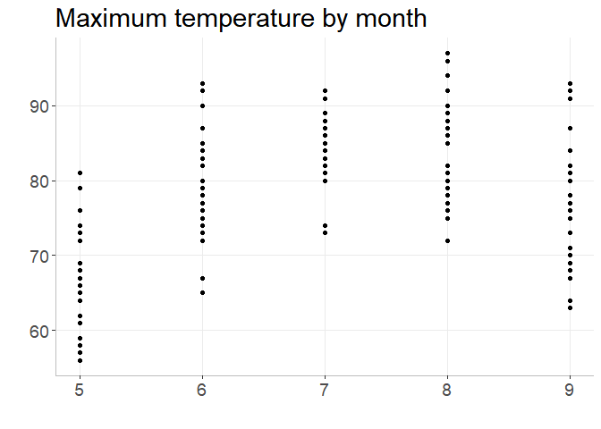

```r
library(gapminder)
library(tidyverse)
```

```
## -- Attaching packages ------------------------------------------------------------------------------------------ tidyverse 1.3.0 --
```

```
## v ggplot2 3.2.1     v purrr   0.3.3
## v tibble  2.1.3     v dplyr   0.8.3
## v tidyr   1.0.2     v stringr 1.4.0
## v readr   1.3.1     v forcats 0.4.0
```

```
## -- Conflicts --------------------------------------------------------------------------------------------- tidyverse_conflicts() --
## x dplyr::filter() masks stats::filter()
## x dplyr::lag()    masks stats::lag()
```


## Motivating the need for factors in R

### Activity 1: Using factors for plotting 

**1.1** Let's look again into `gapminder` dataset and create a new column, 
`life_level`, that contains five categories ("very high", "high","moderate", 
"low", "very low") based on life expectancy in 1997. Assign categories accoring 
to the table below:

| Criteria | life_level| 
|-------------|-----------|
| less than 23 | very low |
| between 23 and 48 | low |
| between 48 and 59 | moderate |
| between 59 and 70 | high |
| more than 70 | very high |

Function `case_when()` is a tidier way to vectorise multiple `if_else()` statements. 
You can read more about this function [here](https://dplyr.tidyverse.org/reference/case_when.html).


```r
gapminder %>% 
  filter(year == 1997) %>% 
  mutate(life_level = case_when(lifeExp < 23 ~ 'very low',
                                lifeExp < 48 ~ 'low' ,
                                lifeExp < 59 ~ 'moderate',
                                lifeExp < 70 ~ 'high',
                                # else
                                TRUE ~ 'very high')) %>% 
  ggplot() + 
  geom_boxplot(aes(x = life_level, y = lifeExp)) +
  labs(y = "GDP per capita, $", x = "Life expectancy level, years") +
  theme_bw() 
```

<!-- -->

Do you notice anything odd/wrong about the graph?

We can make a few observations:

- It seems that none of the countries had a "very low" life-expectancy in 1997. 

- However, since it was an option in our analysis it should be included in our plot. Right?

- Notice also how levels on x-axis are placed in the "wrong" order.

**1.2** You can correct these issues by explicitly setting the levels parameter 
in the call to `factor()`. Use, `drop = FALSE` to tell the plot not to drop 
unused levels.


```r
gapminder %>% 
  filter(year == 1997) %>% 
  mutate(life_level = factor(
                      case_when(lifeExp < 23 ~ 'very low',
                                lifeExp < 48 ~ 'low' ,
                                lifeExp < 59 ~ 'moderate',
                                lifeExp < 70 ~ 'high',
                                # else
                                TRUE ~ 'very high'),
                      levels = c("very low", "low", "moderate", "high", "very high")
)
) %>%
  ggplot() + 
  geom_boxplot(aes(x = life_level, y = lifeExp)) +
  labs(y = "GDP per capita, $", x = "Life expectancy level, years") +
  theme_bw() +
  scale_x_discrete(drop= FALSE)
```

<!-- -->

## Activity 2: Inspecting factors

In Activity 1, we created our own factors, so now let's explore what 
categorical variables that we have in the `gapminder` dataset.

### **2.1** Exploring `gapminder$continent`

Use functions such as `str()`, `levels()`, `nlevels()` and `class()` to 
answer the following questions:

- What class (type of object) is `continent` (a factor or character)? factor
- How many levels? What are they? 5 levels. Africa, Americas, Asia, Europe, and Oceania
- What integer is used to represent factor "Asia"? 3


```r
class(gapminder$continent)
```

```
## [1] "factor"
```

```r
levels(gapminder$continent)
```

```
## [1] "Africa"   "Americas" "Asia"     "Europe"   "Oceania"
```

```r
nlevels(gapminder$continent)
```

```
## [1] 5
```

```r
str(gapminder$continent)
```

```
##  Factor w/ 5 levels "Africa","Americas",..: 3 3 3 3 3 3 3 3 3 3 ...
```

### **2.2** Exploring `gapminder$country`

Let's explore what else we can do with factors. Answer the following questions: 

- How many levels are there in `country`?
- Filter `gapminder` dataset by 5 countries of your choice. How many levels are 
  in your filtered dataset?


```r
nlevels(gapminder$country)
```

```
## [1] 142
```

```r
h_countries <- c("Albania", "Afghanistan", "Algeria", "Angola", "Argentina")
h_gap <-gapminder %>%
  filter(country %in% h_countries)
nlevels(h_gap$country)
```

```
## [1] 142
```

## Dropping unused levels

What if we want to get rid of some levels that are "unused" -- how do we do that? 

The function `droplevels()` operates on all the factors in a data frame or on a 
single factor. The function `forcats::fct_drop()` operates on a factor and does 
not drop `NA` values.


```r
h_gap_dropped <- h_gap %>% 
  droplevels()

h_gap_dropped$country %>%
  nlevels()
```

```
## [1] 5
```

## Changing the order of levels

Let's say we wanted to re-order the levels of a factor using a new metric - say, count().

We should first produce a frequency table as a tibble using `dplyr::count()`:


```r
gapminder %>%
count(continent)
```

```
## # A tibble: 5 x 2
##   continent     n
##   <fct>     <int>
## 1 Africa      624
## 2 Americas    300
## 3 Asia        396
## 4 Europe      360
## 5 Oceania      24
```

The table is nice, but it would be better to visualize the data.
Factors are most useful/helpful when plotting data.
So let's first plot this:


```r
gapminder %>%
  ggplot() +
  geom_bar(aes(continent)) +
  coord_flip() +
  theme_bw() +
  ylab("Number of entries") + xlab("Continent")
```

<!-- -->

Think about how levels are normally ordered. 
It turns out that by default, R always sorts levels in alphabetical order. 
However, it is often preferable to order the levels according to some principle:

  1. Frequency/count (`fct_infreq()`)
  2. Order of appearance (`fct_inorder()`)
  3. Sequence of the underlying integers (`fct_inseq()`)
  
- Make the most common level the first and so on. Function like `fct_infreq()` 
  might be useful.
- The function `fct_rev()` will sort them in the opposite order.


```r
gapminder %>%
  ggplot() +
  geom_bar(aes(fct_infreq(continent))) +
  coord_flip() +
  theme_bw() +
  ylab("Number of entries") + xlab("Continent")
```

<!-- -->

Section 9.6 of Jenny Bryan's [notes](https://stat545.com/factors-boss.html#reorder-factors) has some helpful examples.

  4. Another variable. 
  
  - For example, if we wanted to bring back our example of ordering `gapminder` 
    countries by life expectancy, we can visualize the results using `fct_reorder()`. 


```r
##  default summarizing function is median()
gapminder %>%
  ggplot() +
  geom_bar(aes(fct_reorder(continent, lifeExp, max))) +
  coord_flip() +
  theme_bw() +
  xlab("Continent") + ylab("Number of entries") 
```

<!-- -->

Use `fct_reorder2()` when you have a line chart of a quantitative x against 
another quantitative y and your factor provides the color. 


```r
## order by life expectancy 
ggplot(h_gap, aes(x = year, y = lifeExp,
                  color = fct_reorder2(country, year, lifeExp))) +
  geom_line() +
  labs(color = "Country")
```

<!-- -->

## Change order of the levels manually

This might be useful if you are preparing a report for say, the state of affairs 
in Africa.


```r
gapminder %>%
  ggplot() +
  geom_bar(aes(fct_relevel(continent, "Africa"))) +
  coord_flip()+
  theme_bw() 
```

<!-- -->

More details on reordering factor levels by hand can be found 
[here](https://forcats.tidyverse.org/reference/fct_relevel.html).

## Recoding factors

Sometimes you want to specify what the levels of a factor should be.
For instance, if you had levels called "blk" and "brwn", you would rather they 
be called "Black" and "Brown" -- this is called recoding.

Lets recode `Oceania` and the `Americas` in the graph above as abbreviations 
`OCN` and `AME` respectively using the function `fct_recode()`.


```r
gapminder %>%
  ggplot() +
  geom_bar(aes(fct_recode(continent, "OCN" = "Oceania", "AME" = "Americas"))) +
  coord_flip() +
  theme_bw()
```

<!-- -->

## Grow a factor (OPTIONAL)

Let’s create two data frames,`df1` and `df2` each with data from two countries, 
dropping unused factor levels.


```r
df1 <- gapminder %>%
  filter(country %in% c("Albania", "Algeria"), year > 1987) %>%
  droplevels()
df2 <- gapminder %>%
  filter(country %in% c("Angola", "Benin"), year > 1987) %>%
  droplevels()
```

The country factors in `df1` and `df2` have different levels.
Can you just combine them using `c()`?


```r
c(df1$country, df2$country)
```

```
##  [1] 1 1 1 1 2 2 2 2 1 1 1 1 2 2 2 2
```

Use `fct_c()` to perform `c()`, but also combine the levels of the two factor
variables:


```r
fct_c(df1$country, df2$country)
```

```
##  [1] Albania Albania Albania Albania Algeria Algeria Algeria Algeria Angola 
## [10] Angola  Angola  Angola  Benin   Benin   Benin   Benin  
## Levels: Albania Algeria Angola Benin
```

Explore how different forms of row binding work behave here, in terms of the 
country variable in the result. 


```r
bind_rows(df1, df2)
```

```
## Warning in bind_rows_(x, .id): Unequal factor levels: coercing to character
```

```
## Warning in bind_rows_(x, .id): binding character and factor vector, coercing
## into character vector

## Warning in bind_rows_(x, .id): binding character and factor vector, coercing
## into character vector
```

```
## Warning in bind_rows_(x, .id): Unequal factor levels: coercing to character
```

```
## Warning in bind_rows_(x, .id): binding character and factor vector, coercing
## into character vector

## Warning in bind_rows_(x, .id): binding character and factor vector, coercing
## into character vector
```

```
## # A tibble: 16 x 6
##    country continent  year lifeExp      pop gdpPercap
##    <chr>   <chr>     <int>   <dbl>    <int>     <dbl>
##  1 Albania Europe     1992    71.6  3326498     2497.
##  2 Albania Europe     1997    73.0  3428038     3193.
##  3 Albania Europe     2002    75.7  3508512     4604.
##  4 Albania Europe     2007    76.4  3600523     5937.
##  5 Algeria Africa     1992    67.7 26298373     5023.
##  6 Algeria Africa     1997    69.2 29072015     4797.
##  7 Algeria Africa     2002    71.0 31287142     5288.
##  8 Algeria Africa     2007    72.3 33333216     6223.
##  9 Angola  Africa     1992    40.6  8735988     2628.
## 10 Angola  Africa     1997    41.0  9875024     2277.
## 11 Angola  Africa     2002    41.0 10866106     2773.
## 12 Angola  Africa     2007    42.7 12420476     4797.
## 13 Benin   Africa     1992    53.9  4981671     1191.
## 14 Benin   Africa     1997    54.8  6066080     1233.
## 15 Benin   Africa     2002    54.4  7026113     1373.
## 16 Benin   Africa     2007    56.7  8078314     1441.
```

```r
rbind(df1, df2)
```

```
## # A tibble: 16 x 6
##    country continent  year lifeExp      pop gdpPercap
##    <fct>   <fct>     <int>   <dbl>    <int>     <dbl>
##  1 Albania Europe     1992    71.6  3326498     2497.
##  2 Albania Europe     1997    73.0  3428038     3193.
##  3 Albania Europe     2002    75.7  3508512     4604.
##  4 Albania Europe     2007    76.4  3600523     5937.
##  5 Algeria Africa     1992    67.7 26298373     5023.
##  6 Algeria Africa     1997    69.2 29072015     4797.
##  7 Algeria Africa     2002    71.0 31287142     5288.
##  8 Algeria Africa     2007    72.3 33333216     6223.
##  9 Angola  Africa     1992    40.6  8735988     2628.
## 10 Angola  Africa     1997    41.0  9875024     2277.
## 11 Angola  Africa     2002    41.0 10866106     2773.
## 12 Angola  Africa     2007    42.7 12420476     4797.
## 13 Benin   Africa     1992    53.9  4981671     1191.
## 14 Benin   Africa     1997    54.8  6066080     1233.
## 15 Benin   Africa     2002    54.4  7026113     1373.
## 16 Benin   Africa     2007    56.7  8078314     1441.
```

library("tidyverse")


```r
ggplot(airquality, aes(`Month`, `Temp`, group = `Month`)) +
    geom_point(outlier.shape = NA) +
    labs(x = "",
         y = "",
         title="Maximum temperature by month") +
    theme_bw() + 
    theme(panel.grid.minor = element_blank(),
          panel.background = element_blank(), 
          axis.line = element_line(colour = "gray"),
          panel.border = element_blank(),
          text = element_text(size=18)
          )
```

```
## Warning: Ignoring unknown parameters: outlier.shape
```

<!-- -->


```r
install.packages("patchwork")
```

```
## Installing package into 'C:/Users/Khalia/Documents/R/win-library/3.6'
## (as 'lib' is unspecified)
```

```
## Error in contrib.url(repos, "source"): trying to use CRAN without setting a mirror
```

```r
install.packages("gridExtra")
```

```
## Installing package into 'C:/Users/Khalia/Documents/R/win-library/3.6'
## (as 'lib' is unspecified)
```

```
## Error in contrib.url(repos, "source"): trying to use CRAN without setting a mirror
```


```r
library(patchwork)
```

```
## Warning: package 'patchwork' was built under R version 3.6.3
```

```r
library(gridExtra)
```

```
## Warning: package 'gridExtra' was built under R version 3.6.3
```

```
## 
## Attaching package: 'gridExtra'
```

```
## The following object is masked from 'package:dplyr':
## 
##     combine
```


```r
p_mpg <- ggplot(mtcars, aes(factor(cyl), mpg, color = factor(cyl))) + 
    geom_boxplot() + theme_bw() + xlab("No. of cylinders") + ylab("MPG")

p_hp <- ggplot(mtcars, aes(factor(cyl), hp, color = factor(cyl))) + 
    geom_boxplot() + theme_bw() + xlab("No. of cylinders") + ylab("Horsepower")

p_mpg + p_hp 
```

<!-- -->
